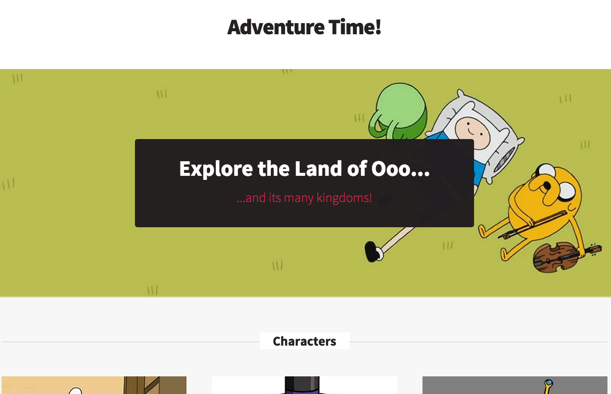

# Static Site Samples

This is a simple example site built using various static site generators to explore the differences between the multitude of available static site options.

The initial samples are [Jekyll](http://jekyllrb.com/), [HarpJS](http://harpjs.com/), [Middleman](https://middlemanapp.com/), [Wintersmith](http://wintersmith.io/), [Hexo](http://hexo.io/), [Hugo](http://gohugo.io/), [DocPad](http://docpad.org/) and [Metalsmith](http://www.metalsmith.io/). More to come.

Sample text and images are taken from the [Adventure Time! Wiki](http://adventuretime.wikia.com/wiki/Adventure_Time_with_Finn_and_Jake_Wiki).

The sample project looks the same in all cases. It was designed to cover specific use cases that are common, basic requirements for a site:

* Custom global data
* Custom post data
* Custom data collections
* Post summaries (i.e. specifying a break point in the text for a summary)
* RSS Feed
* Date display formatting

##Assumptions

In order to make "fair" comparisons, all of the examples are (initially) built using the default templating language. If an engine supports multiple defaults, the sample is built with the language used in the generated templates (for example, Harp supports Jade and EJS by default but the generated templates use Jade, so the initial sample was built with Jade).

##Jekyll Example

To get started, you'll need to install Jekyll (no official Windows support is available but a [workaround](http://jekyllrb.com/docs/windows/#installation) is available). Jekyll is Ruby-based.

    sudo gem install jekyll

Once you have Jekyll installed, simply change directory into the sample and start a local server:

    cd jekyllsite
    jekyll serve

The Jekyll samples are built with the [Liquid template engine](https://github.com/Shopify/liquid) and YAML for the data (YAML was chosen because the default templates use YAML for data, although JSON and CSV are supported).

For a thorough tutorial on how to use Jekyll and how the sample site was built, read [this article on the Telerik Developer Network](http://developer.telerik.com/featured/getting-started-with-jekyll/).

##Middleman Example

Middleman is also Ruby-based but does officially support Windows via [RubyInstaller](http://rubyinstaller.org/). To install Middleman, use:

    sudo gem install middleman

Once you have Middleman installed, first change directory into the sample. The example uses a [LiveReload plugin](https://github.com/middleman/middleman-livereload), so you will need to install the bundles specified in the Gem file before starting the server. Then, start the server.

    cd middlemansite
    bundle install
    middleman

The Middleman examples are built using the [Erb](http://ruby-doc.org/stdlib-2.2.0/libdoc/erb/rdoc/) templating language and YAML for the data.

##Harp Examples

Harp is available via npm. To install it, simple enter (install may require `sudo`):

    sudo npm install -g harp

Harp has two examples. The initial example was built using the [Jade templating language](http://jade-lang.com/) and JSON for data. While Harp supports both Jade and EJS by default, the generated templates use Jade, so it was chosen initially. To run this example simply change directory into the sample folder and start a local server.

    cd harpsite
    harp server

By default, Harp supports both Jade and [EJS](http://www.embeddedjs.com/). A second sample was built with Harp and EJS.

    cd harpsite_ejs
    harp server

##Wintersmith Example

Wintersmith is also available via npm (install may require `sudo`):

    sudo npm install -g wintersmith

To run the project on a local server, simply change directory and start a preview:

    cd wintersmithsite
    wintersmith preview

Wintersmith comes bundled with Jade templating support. The data uses JSON.

For a detailed walkthrough covering how the Wintersmith example site was built and check out the two part series on Sitepoint:

* [Getting Started with Wintersmith: A Node.js-based Static Site Generator](http://www.sitepoint.com/getting-started-wintersmith-nodejs-static-site-generator/)
* [Creating Posts, Custom Metadata, and Data in Wintersmith](http://www.sitepoint.com/creating-posts-custom-metadata-data-wintersmith/)

##Hexo Example

Hexo is also available via npm (install may require `sudo`):

    npm install hexo-cli -g

To run the project on a local server, simply change directory and start a preview:

    cd hexosite
    npm install
    hexo server

Hexo comes bundled with both EJS and Swig templating support (the generated starter uses EJS, so this was chosen). The data uses YAML.

##Hugo Example

Hugo is built with the Go programming language. There are a number of OS-specific [installable downloads](https://github.com/spf13/hugo/releases) or, if you are on OSX, you can install Hugo via [Brew](http://brew.sh/):

    brew install hugo

To run the example, change directory and start a local server preview:

    cd hugosite
    hugo server

Hugo templates are built with the Go html/template library. Data files are TOML.

##DocPad Example

DocPad is built with CoffeeScript and is available via npm (install may require `sudo`).

    npm install -g docpad

In order to run the example, you will need to install a number of additional dependencies as much functionality in DocPad is added via plugins. These are all specified in the package.json, so all that should be needed is:

    docpad install

Here's the full list of depencency installs if you choose to add them individually:

    docpad install eco
    docpad install partials
    docpad install marked
    docpad install rss

[Eco](https://github.com/sstephenson/eco) was chosen for the template engine since it is what the docs specify - though other templating engines are supported via additional plugins.

##Wyam Example

Wyam is a .NET generator written in C#. It currently runs on Windows and can be [downloaded as an installer or as binaries](https://github.com/Wyamio/Wyam/releases).

To run the example, start the Wyam Command Prompt (if installed via the Windows installer), change the directory, and start the local preview server:

    cd wyamsite
    wyam -p

If you downloaded and extracted the binaries without the installer, just point to the `wyam.exe` executable wherever it was extracted when you run the site.

Wyam templates are built with Razor and Markdown is used for content pages with YAML front matter.

###Known Issues

Data was added as YAML "front matter" to the home page as (after much research), I could not find another way to include arbitrary data on a page via an external YAML or JSON file. This is not ideal as the data cannot be reused.

##Metalsmith Example

Metalsmith is written in JavaScript and available via npm. Metalsmith is not installed globally, so, when installing the sample, you'll simply need to add it with all other dependencies via npm (may require `sudo`).

    cd metalsmithproject
    npm install

Since _everything_ in Metalsmith is a plugin, there are a lot of them used. Here's a full install list if you wish to add them individually.

    npm install metalsmith-markdown
    npm install metalsmith-layouts
    npm install handlebars
    npm install metalsmith-permalinks
    npm install metalsmith-assets
    npm install metalsmith-serve
    npm install metalsmith-metadata
    npm install metalsmith-collections
    npm install metalsmith-date-formatter
    npm install metalsmith-more
    npm install metalsmith-page-title
    npm install metalsmith-feed

The templates were done in Handlebars since this is what is used in most of the examples (though the Metalsmith templates plugin supports a wide array of templating options).

###Known Issues

* The metalsmith-metadata plugin notes issues note [inconsistent behavior across Mac and Windows](https://github.com/segmentio/metalsmith-metadata/issues/5#issuecomment-117334325). The examples were built on a Mac.
* The metalsmith-collections plugin [pattern matching doesn’t work when using the CLI](https://github.com/segmentio/metalsmith-collections/issues/18). As there is no way to limit the loop in Handlebars without a helper (which would have required I convert the project to use the JavaScript build file instead of the CLI), I hacked a solution by creating two separate collections. This had an important implication in that the RSS feed only lists one of the two collections (i.e. featured).
* The dates formatting for the posts in the footer are a total hack using JavaScript. The metalsmith-date-formatter plugin only allows one date format per date in the metadata and, since the project uses the CLI, there was no access to creating a Handlebars helper to format the date.

The latter two issues seem as though they could be resolved by converting the project from using the CLI (and the metalsmith.json) to build the project to using a JavaScript build file.
